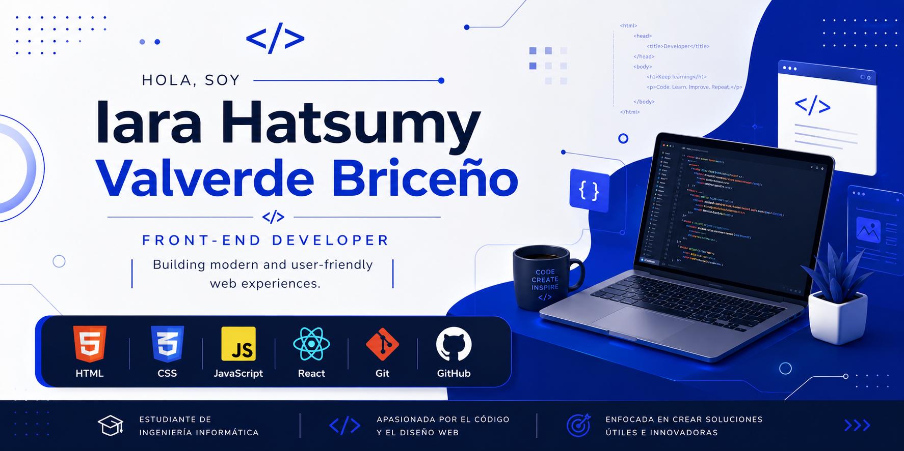

  

# ¡Hola! 👋 Soy Iara Hatsumy Valverde

### 💻 Estudiante de Ingeniería Informática | Front-End Developer

Soy estudiante de Ingeniería Informática con interés en el desarrollo web y la creación de interfaces modernas, intuitivas y funcionales.

Actualmente desarrollo proyectos utilizando HTML, CSS, JavaScript, React, PHP, Java y MySQL. Me gusta aprender nuevas tecnologías y construir aplicaciones que resuelvan problemas reales.

🌱 Actualmente aprendiendo:
- React
- Tailwind CSS
- Desarrollo Front-End

🎯 Objetivo:
Convertirme en Front-End Developer y seguir creciendo como desarrolladora de software.

---

## 🛠️ Tecnologías y Herramientas

  

## 📊 Estadísticas de GitHub

  
  

